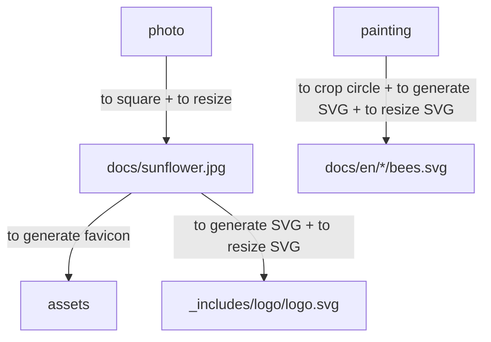

# The jekyll-themed site is up!

<!--more-->

# NOTES

* Old page: [https://jhz22.user.srcf.net/](https://jhz22.user.srcf.net/)

The workflow to set up

* To crop circle: [https://crop-circle.imageonline.co/](https://crop-circle.imageonline.co/)
* To square, [https://www.oddprints.com/edit](https://www.oddprints.com/edit)
* To resize, [https://imagemagick.org/index.php](https://imagemagick.org/index.php)
```bash
convert sunflower.jpg -resize 15% sun15.jpg
```  
* To generate favicon, [https://realfavicongenerator.net/](https://realfavicongenerator.net/)
* To generate SVG, [https://inkscape.org/](https://inkscape.org/)
* To resize SVG, [https://www.iloveimg.com/resize-image/resize-svg](https://www.iloveimg.com/resize-image/resize-svg)
* To replace logo.svg at assets/image/logo and _includes/svg
 
---

```javascript
(() => console.log('Updated!'))();
```
