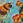

# Other projects

* Epigenomics
  * [EWAS-fusion](https://jinghuazhao.github.io/EWAS-fusion/)[^longnote] ()
  * [QTR](https://jinghuazhao.github.io/QTR/) ()

* Genomics
  * [FM-pipeline](https://jinghuazhao.github.io/FM-pipeline/) ()
  * [hess-pipeline](https://jinghuazhao.github.io/hess-pipeline/) ()
  * [PW-pipeline](https://jinghuazhao.github.io/PW-pipeline/) ()
  * [SUMSTATS](https://jinghuazhao.github.io/SUMSTATS/) ()
  * [TWAS-pipeline](https://jinghuazhao.github.io/TWAS-pipeline/) ()

* Proteomics
  * [Caprion](https://jinghuazhao.github.io/Caprion/) ()
  * [Olink-NGS](https://jinghuazhao.github.io/Olink-NGS/) ()
  * [SomaLogic](https://jinghuazhao.github.io/SomaLogic/) ()
  * [SWATH-MS](https://jinghuazhao.github.io/SWATH-MS/) ()

* Statistics
  * [Computational statistics](https://jinghuazhao.github.io/Computational-Statistics/) ()
  * [DSA](https://jinghuazhao.github.io/DSA/) ()
  * [Mixed models](https://jinghuazhao.github.io/Mixed-Models/) ()
  * [Numerical analysis](https://jinghuazhao.github.io/Numerical-Analysis/) ()

* Miscellaneous categories
  * [GDCT](https://jinghuazhao.github.io/GDCT/) ()
  * [GWAS course](https://jinghuazhao.github.io/GWAS-course/) ()
  * [Omics-analysis](https://jinghuazhao.github.io/Omics-analysis/) ()
  * [PhD](https://jinghuazhao.github.io/PhD/) ()
  * [physalia](https://jinghuazhao.github.io/physalia/) ()
  * [Software notes](https://jinghuazhao.github.io/software-notes/) ()

[^longnote]: Transcriptomewide association statistic $z_{TWAS}$ was originally proposed for gene expression data. For a given Trait of interest **T** for which GWAS summary statistics $z_T$ is available, the corresponding Wald statistic for TWAS is defined such that $$z_{TWAS} = \frac{w^T_{ge}z_T}{\sqrt{w^T_{ge}Vw_{ge}}}$$ where $w_{ge}$ is a weight associated with gene expression and **V** covariance matrix for $z_T$, respectively. By analogy, an epigenomewide association statistic $z_{EWAS}$ is defined through methylation data so that $$z_{EWAS} = \frac{w^T_{me}z_T}{\sqrt{w^T_{me}Vw_{me}}}$$ where $w_{me}$ is the weight associated with methylation. Both approaches allow for imputation using GWAS summary statistics. The derivation of these weights and imputation were done using methods called Functional Summary-based Imputation (FUSION).
