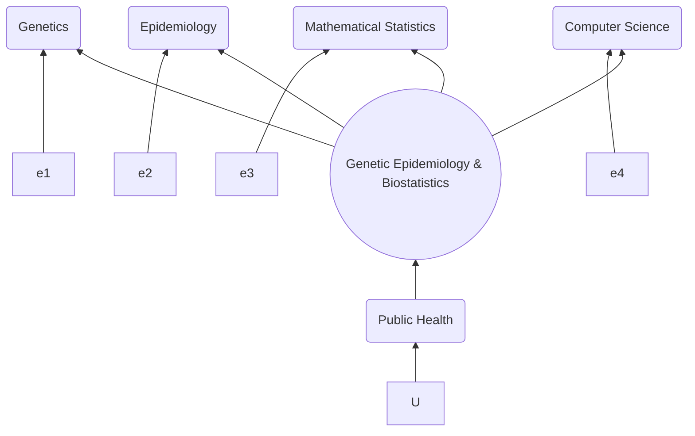

I have promoted reproducible research through presentations, software implementation and various projects.

## Presentations

* [useR!2007](http://www.user2007.org/),
* [useR!2008](http://www.statistik.uni-dortmund.de/useR-2008/tutorials/),
* [useR!2009](http://www.r-project.org/conferences/useR-2009/tutorials/index.html),
* [useR!2010](http://www.r-project.org/conferences/useR-2010/tutorials/index.html),
* [useR!2011](https://www.r-project.org/conferences/useR-2011/),
* [GWAS course](https://jinghuazhao.github.io/GWAS-course/), 
* Henry-Stewart and local talks

## Bookmarks

* [PHPC](phpclinks.md),
* [MRC](mrclinks.md) with [comments](mrc/comments.txt),
* [UCL](ucllinks.md),
* [KCL](kcllinks.md) with [comments](iop/comments.txt) and a [diagram](focus.gif)\--[a mermaid version](iop/focus.png)), 

and [graphviz](grViz.gv) which can be viewed from RStudio.
* [software collections](r-genetics.md).

## Projects

* [consortium](https://jinghuazhao.github.io/en/consortium) projects.
* [other](https://jinghuazhao.github.io/en/others) projects.

## Related activities

At CEU, I am part of the [cambridge-ceu](https://cambridge-ceu.github.io/) GitHub organisation.

## A gentle call

I would appreciate if you [e-mail me](mailto:jinghuazhao@hotmail.com) your comments or information on [citations](references.txt) (Google Scholar on [R/gap](https://tinyurl.com/yxh3ycwg)).
