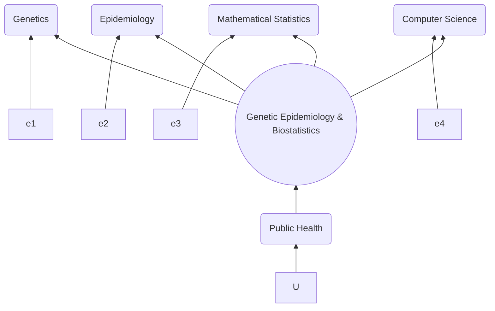
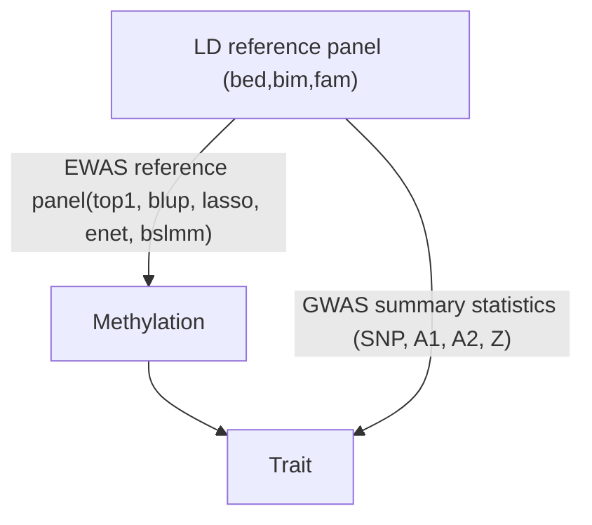

I promoted reproducible research through presentations at
[useR!2007](http://www.user2007.org/),
[useR!2008](http://www.statistik.uni-dortmund.de/useR-2008/tutorials/),
[useR!2009](http://www.r-project.org/conferences/useR-2009/tutorials/index.html),
[useR!2010](http://www.r-project.org/conferences/useR-2010/tutorials/index.html),
[useR!2011](https://www.r-project.org/conferences/useR-2011/), [GWAS course](https://jinghuazhao.github.io/GWAS-course/), Henry-Stewart and
local talks as with [software collections](r-genetics.md). I collected
bookmarks ([MRC](mrclinks.md) with [comments](mrc/comments.txt),
[UCL](ucllinks.md) and [KCL](kcllinks.md) with
[comments](iop/comments.txt) and a [diagram](focus.gif)\--[a mermaid version](iop/focus.png)), 

I created [DSA](https://jinghuazhao.github.io/DSA), [Numerical Analysis](https://jinghuazhao.github.io/Numerical-Analysis),
[Computational Statistics](https://jinghuazhao.github.io/Computational-Statistics/),
[physalia](https://jinghuazhao.github.io/physalia/), [software notes](https://jinghuazhao.github.io/software-notes/), 
[Omics resources](https://github.com/jinghuazhao/Omics-analysis/wiki/Resources),
as well as developed [software](software.md) (esp. [Haplotype Analysis](https://jinghuazhao.github.io/Haplotype-Analysis/),
[R](https://jinghuazhao.github.io/R/) and more recently
[FM-pipeline](https://jinghuazhao.github.io/FM-pipeline/) and
[PW-pipeline](https://jinghuazhao.github.io/PW-pipeline/)) on
[GitHub](https://github.com/jinghuazhao?tab=repositories) and
[CRAN](http://cran.r-project.org/).

The following is an excerpt from the [EWAS-fusion](https://jinghuazhao.github.io/EWAS-fusion/) pipeline.

and the mathematical expression of the test statistic is
$$ z_{EWAS} = \frac{w^T_{me}z_T}{\sqrt{w^T_{me}Vw_{me}}} $$

At CEU, I am part of the [cambridge-ceu](https://cambridge-ceu.github.io/) GitHub organisation.
