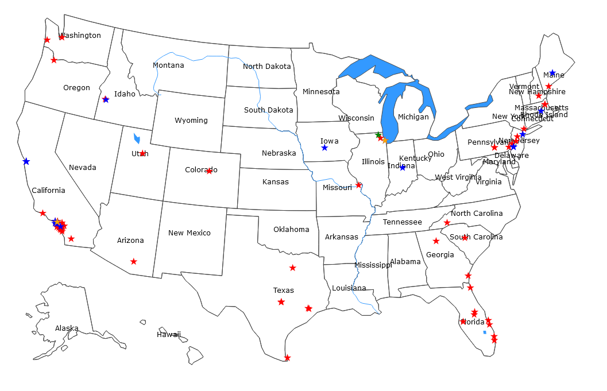

# Resource

<select id="page-dropdown">
    <option value="">--Select a map--</option>
    <option value="leaflet.html">leaflet.js</option>
    <option value="scattermapbox.html">plotly.js</option>
    <option value="scattergeo.html">plotly.js+US map</option>
</select>

**View by selection or click an image to expand** (*geographic coordinates subject to change*)

## Drug and substance abuse

* 449 Recovery, <https://449recovery.org/>
- Acquare Recovery, <https://www.acquarecovery.com/>
* Addiction Resources in Northern Illinois, <https://www.northernillinoisrecovery.com/resources/>
* Adelante Recovery Center, <https://adelanterecovery.com/>
- Alcohol Rehab Help, <https://alcoholrehabhelp.org/>
- Ambrosia Treatment Center, <https://www.ambrosiatc.com/>
* Amethyst Recovery DeTox, <https://www.amethystrecovery.org/>
* Amity San Diego, <https://amitysd.com/>
* Arkview Recovery Center, <https://www.arkviewrecovery.com/>
* AToN Center, <https://www.atoncenter.com/>
* Bayview Recovery Center, <https://www.bayviewrecovery.com/>
+ Blue Star Recovery, <https://bluestarrecovery.com/>
+ California Treatment Center, <https://californiaaddictiontreatment.com/>
- Casco Bay Recovery, The Leading Addiction Treatment Center for Portland, Maine, <https://cascobayrecovery.com/>
* Crestview Recovery, <https://www.crestviewrecovery.com/>
* Denoon Recovery Center, <https://www.denoonrecovery.com/>
* Discovery Institute, <https://www.discoverynj.org/>
* Drug and Alcohol Addiction Treatment Services, <https://addiction-treatment-services.com/>
* Eagle Creek Ranch Recovery, <https://idahorecoverycenter.com/>
- First City Recovery Center, <https://firstcityrecoverycenter.com/programs/>
- First Step Recovery, <https://firststepsrecovery.com/>
- FreebytheSea Sunset View Drug & Alcohol Recovery Center, <https://freebythesea.com>
* Georgia Sky Outpatient Detox, <https://georgiaskyoutpatientdetox.com/>
- Golden Gate Recovery, <https://goldengaterecovery.com/>
- Immersive Recovery, <https://immersiverecovery.com/>
* IOP Addiction Treatment for Men, <https://www.recoverintegrity.com/>
* Jay Walker Lodge, <https://jaywalkerlodge.com/>
- Laguna Shores Recovery, <https://lagunashoresrecovery.com/>
* Legends Recovery Center LLC, <https://legendsrecovery.com/>
* Live Free Recovery Services -- Drug Rehab Program,  <https://livefreerecoverynh.com/programs/>
- Magnolia City Detox, <https://magnoliacitydetox.com/programs/>
- Mana Recovery, <https://manarecoverycenter.com/>
* Massachusetts Addiction Treatment Center, <https://advancedaddictioncenter.com/>
* Melrose Recovery, <https://www.melroserecovery.com/>
* Moving Mountains Recovery, <https://movingmountainsrecovery.com/>
* MPower Wellness Exton, <https://mpowerwellness.com/>
* Origins Texas Recovery, <https://www.originstexas.com/>
* Orlando Treatment Solutions, <https://orlandotreatmentsolutions.com/>
+ Path To Recovery Detox, <https://pathtorecoverydetox.com/>
+ Pathways Treatment Center, <https://pathwaystreatmentcenter.com/>
+ Principles Recovery Center, <https://principlesrecoverycenter.com/>
* Rebirth Recovery Center, <https://rebirthrecoverycenter.com/>
* Sana Lake Recovery Behavioral Wellness Center, <https://sanalake.com/service-areas/maryland-heights/>
- Sabino Recovery, <https://www.sabinorecovery.com/>
- Santa Barbara Recovery, <https://santabarbararecovery.com/>
* Smoke free UK, <https://smokefreeuk.co.uk/>
- Spero Recovery, <https://www.sperorecovery.org/>
* Surf City Detox, <https://surfcitydetox.com/>
* The Freedom Center, <https://www.thefreedomcenter.com/>
* The Lovett Center, <https://thelovettcenter.com/>
+ The Recovery Village Cherry Hill at Cooper, <https://www.southjerseyrecovery.com/>
* The Villa Kali Ma holistic addiction and mental health recovery centers, <https://villakalima.com/>
- True Life Recovery, <https://trueliferecovery.com/>
* Westwind Behavioral Health Treatment, <https://www.westwindrecovery.com/>
* White Lotus Landing, <https://www.whitelotuslanding.com/>
* Wisconsin Recovery Institute, <https://wisconsinrecoveryinstitute.com/resources/>
* Yonder Behavioral Health, <https://yonderbh.com/>

## Physical, mental and behavioral Health

* Adler Health, <https://adlerhealth.com/>
* Arkview Recovery Center (+Anxiety/Depression), <https://www.arkviewrecovery.com/>
* Blume Behavioral Health, <https://blumebh.com/>
* Breakwater Behavioral Health, <https://breakwaterbehavioralhealth.com/>
* California Healing Centers, <https://californiahealingcenters.com/>
* Elevated Wellness Clinic, <https://elevatedwellnessclinic.com/>
* Evolve Wellness, <https://www.evolvewellnessinc.com/>
* Idaho Empowered, <https://idahoempowered.com/>
* Innercept, <https://www.innercept.com/>
* Ironwood Maine, <https://www.ironwoodmaine.com/>
* Lightwork Therapy & Recovery, <https://lightworktr.com/>
* Mental Health Speak, <https://mentalhealthpeak.com/>
* Monroe Street Housing, <https://monroestreetsoberliving.com/>
* Paradigm Treatment, <https://paradigmtreatment.com/>
* Shortridge Academcy, <https://www.shortridgeacademy.com>
* SoCal Empowered, <https://socalempowered.com/>
* Taste Recovery, <https://www.tasterecovery.com/>
+ The Ridge, <https://theridgertc.com/>
* Tusk Kratom, <https://tuskkratom.com/>
* West Valley Detox, <https://westvalleydetox.com/>

## Social care

* Shepherd Premier Senior Living, <https://shepherdpremierseniorliving.com/>

## Sheltering & building

- All-Type Roofing Services, <https://www.all-typeroofingservices.com/>
- Allied Buildings, <https://www.alliedbuildings.com/>

---

  
Featured articles & sites

  <h3>Alcohol consumption</h3>
  <ul>
    <li><a href="https://alcoholrehabhelp.org/addiction/effects/cancer/">Does alcohol cause cancer?</a></li>
    <li><a href="https://www.spirehealthcare.com/health-hub/specialties/general-health/how-alcohol-can-affect-your-liver/">How alcohol can affect your liver</a></li>
    <li><a href="https://www.spirehealthcare.com/health-hub/specialties/lifestyle-management/how-much-alcohol-is-too-much/">How much alcohol is too much?</a></li>
    <li><a href="https://alcoholchange.org.uk/alcohol-facts/interactive-tools/unit-calculator">Unit calculator</a></li>
  </ul>

  <h3>Food intake</h3>
  <ul>
    <li><a href="https://www.bbc.co.uk/food/articles/grow_out_food_allergy">Can you grow out of a food allergy?</a></li>
    <li><a href="https://www.cancerresearchuk.org/about-cancer/causes-of-cancer/diet-and-cancer/does-eating-processed-and-red-meat-cause-cancer">Processed/red meat and cancer</a></li>
    <li><a href="https://www.nhs.uk/live-well/eat-well/food-guidelines-and-food-labels/the-eatwell-guide/">The Eatwell Guide (NHS)</a></li>
    <li><a href="https://www.bbc.co.uk/food/articles/what_is_ultra-processed_food">Ultra-processed food</a></li>
  </ul>

  <h3>Ozempic (semaglutide)</h3>
  <ul>
    <li><a href="https://www.drugwatch.com/drugs/ozempic/">Ozempic (DrugWatch)</a></li>
    <li><a href="https://www.drugwatch.com/drugs/ozempic/side-effects/">Ozempic side effects</a></li>
    <li><a href="https://www.drugwatch.com/">DrugWatch homepage</a></li>
  </ul>

  <h3>Other links</h3>
  <ul>
    <li><a href="https://www.bbc.co.uk/programmes/articles/51SPhn5FKSYRnQNswfnWsN2/8-reasons-why-we-should-all-walk-more">8 reasons why we should all walk more</a></li>
    <li><a href="https://fakefragrances.com/">Fake Fragrances</a></li>
    <li><a href="https://knowyourdna.com/">Know Your DNA</a></li>
    <li><a href="https://www.ted.com/talks/worklife_with_adam_grant_the_real_reason_you_procrastinate/transcript">The real reason you procrastinate</a></li>
    <li><a href="https://www.wma.net/policies-post/wma-declaration-of-helsinki/">WMA Declaration of Helsinki</a></li>
  </ul>

## Contributors<a href="https://jinghuazhao.github.io/resource.txt" style="font-size: 16px; font-size: 90%;vertical-align: top;"><i class="fa fa-heart" style="font-size:22px;color:red"></i></a>

- Enmanuel Batista <ebatista@drugwatch.com>
- Mara Davis <mara@hr.knowyourdna.com>
- Eliza Hadley, <eliza.hadley@gv.alcoholrehabhelp.org>
- Dominique Legget, <dominique.legget@thedigitalintellect.com>
- Nomhle Mcunu <nmcunu@southjerseyrecoverypr.com>
- Rachel Parker, <iamrachelparker@gmail.com>
- Emma Tressler, <healthcare@thedigitalintellect.com>

***Created on** 12/1/2023 and **last changed** 12/12/2025*
