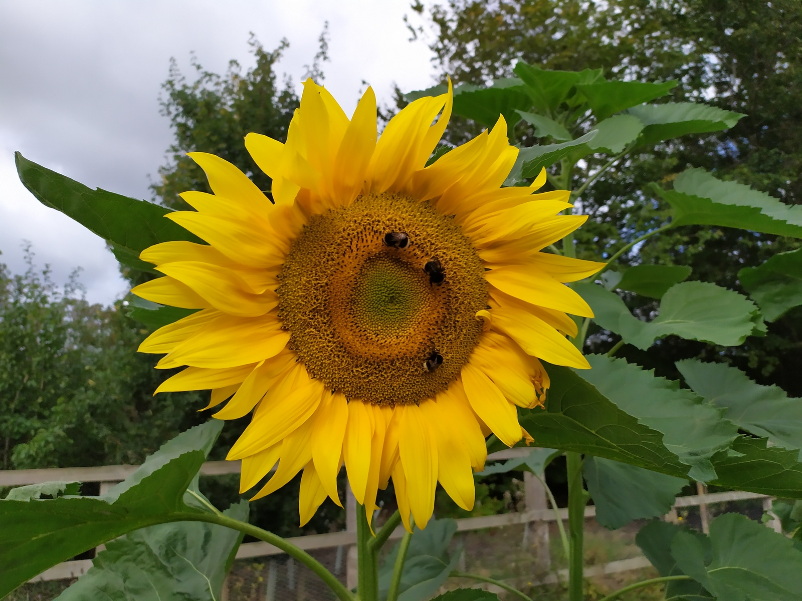

{:.circle}

My field is statistics, epidemiology and public heatlth with specific
interest in [genetic analysis of complex
traits](https://jinghuazhao.github.io/GDCT/) especially
[Omics-Analysis](https://jinghuazhao.github.io/Omics-analysis/). I am
working with the [SCALLOP consortium](https://www.olink.com/scallop/)
following recent work on design and analysis for [Whitehall
II](http://www.ucl.ac.uk/whitehallII),
[ELSA](http://www.natcen.ac.uk/elsa/),
[EPIC-Norfolk](http://www.epic-norfolk.org.uk/),
[Fenland](http://www.mrc-epid.cam.ac.uk/research/studies/fenland/),
[InterAct](http://www.inter-act.eu/), [NSHD](http://www.nshd.mrc.ac.uk/)
and [Framingham](http://www.framinghamheartstudy.org/). The EPIC-Norfolk
genomewide association study contributed to consortia such as
[GIANT](http://www.broadinstitute.org/collaboration/giant/index.php/Main_Page)
and [CHARGE](http://web.chargeconsortium.com/) therefore myself as a
[highly cited researcher](https://clarivate.com/hcr/). I am a member of
the [Royal Statistical Society](http://www.rss.org.uk/) ([My RSS](https://rss.org.uk/myrss/))
and here are my [biosketch](jing_cv.pdf) and [ResearchGate
profile](http://www.researchgate.net/profile/Jing_Hua_Zhao/). I finished
my term as associate editor for [The Scientific World
Journal](http://www.hindawi.com/journals/tswj/) in July 2017 and recently
became an associate editor ([login](https://www.frontiersin.org/my-frontiers/overview))
for [Frontiers in Genetics](http://www.frontiersin.org/) ([blog
network](http://www.frontiersin.org/blog/all_blogs) and
[profile](http://community.frontiersin.org/people/Jing_HuaZhao/44539))
after about ten years as a review editor. Over years I have also been an occasional
reviewer for the [Lancet](https://www.editorialmanager.com/THELANCET/default.aspx).

